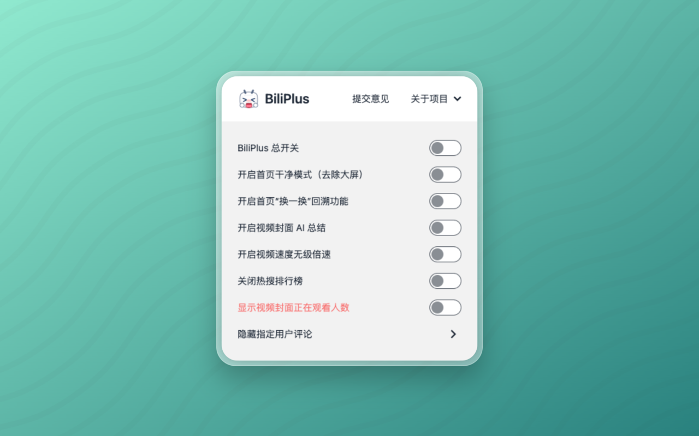

<a name="readme-top"></a>


<!-- PROJECT SHIELDS
[![Contributors][contributors-shield]][contributors-url]
[![Forks][forks-shield]][forks-url]
[![Stargazers][stars-shield]][stars-url]
[![Issues][issues-shield]][issues-url]
[![MIT License][license-shield]][license-url]
 -->


<!-- PROJECT LOGO -->
<br />
<div align="center">
  
  <!--
  
  <a href="https://github.com/0xlau/biliplus">
    
  </a>

  <h3 align="center">BiliPlus Extension</h3>
  
  -->

  <a href="https://trendshift.io/repositories/9629" target="_blank"></a>

  <p align="center">
    <!-- A Chrome extension to make better in bilibili.com -->
    <a href="https://chrome.google.com/webstore/detail/liddcdcjkpeaiblhebgihpmcaknpgbgk"><strong>Explore the chrome web store »</strong></a>
    <br />
    <a href="https://microsoftedge.microsoft.com/addons/detail/ngkocakjkiflceafceddcmiolmdmmpcf"><strong>Explore the edge web store »</strong></a>
    <br />
    <a href="https://addons.mozilla.org/zh-CN/firefox/addon/biliplus-bilibili-%E5%8A%A0%E5%A4%A7%E6%9D%AF-%E7%BB%86%E8%8A%82%E4%BB%8E%E5%A4%A7%E6%9D%AF%E5%81%9A%E8%B5%B7"><strong>Explore the firefox web store »</strong></a>
    <br />
    <br />
    <a href="https://chrome.google.com/webstore/detail/liddcdcjkpeaiblhebgihpmcaknpgbgk">Chrome Extension</a>
    ·
    <a href="https://github.com/0xlau/biliplus/issues">Report Bug</a>
    ·
    <a href="https://github.com/0xlau/biliplus/issues">Request Feature</a>
  </p>
</div>


<!-- TABLE OF CONTENTS -->
<details>
  <summary>Table of Contents</summary>
  <ol>
    <li>
      <a href="#about-the-project">About The Project</a>
    </li>
    <li>
      <a href="#getting-started">Getting Started</a>
      <ul>
        <li><a href="#install-from-web-store">Install From Web Store</a></li>
        <li><a href="#manual-installation">Manual Installation</a></li>
      </ul>
    </li>
    <li><a href="#roadmap">Roadmap</a></li>
    <li><a href="#patches">Patches</a></li>
    <li><a href="#contributing">Contributing</a></li>
    <li><a href="#license">License</a></li>
    <li><a href="#contact">Contact</a></li>
    <li><a href="#acknowledgments">Acknowledgments</a></li>
  </ol>
</details>


<!-- ABOUT THE PROJECT -->
## About The Project

<div align="center">
  
</div>

<br/>

[Bilibili.com](https://bilibili.com) actually has a perfect user experience, but as a developer who pays attention to details, there may still be some areas that make us uncomfortable, so this extension was born.

Principle:
* Does not affect the original appearance.
* Maintain consistent Bilibili style.
* If you feel uncomfortable in Bilibili.com, come and request feature.

<p align="right">(<a href="#readme-top">back to top</a>)</p>

<!-- GETTING STARTED -->
## Getting Started

This is an example of how you may give instructions on setting up this project locally.
To get a local copy up and working follow these simple example steps.

### Install From Web Store

1. Open the [Chrome Web Store](https://chrome.google.com/webstore/detail/liddcdcjkpeaiblhebgihpmcaknpgbgk).
2. click `Add to Chrome`.
3. If you're adding an extension:
    * Review the types of data that the extension will be able to access.
    * Click Add extension.
You'll see your extensions in Chrome as buttons on the toolbar.

### Manual Installation

_Below is an example of how you can manual installing from source code._

1. Clone the repo
   ```sh
   git clone https://github.com/0xlau/biliplus.git
   ```
2. Execute Command to make a zip file
   ```sh
   # Linux/MacOS
   > make

   # Windows
   > ./make.bat
   ```
3. Found a file called `biliplus.zip`
   ```sh
   > ls
   biliplus.zip
   ```
4. Dragging `biliplus.zip` to Chrome/Edge Extension Page
    ```sh
    # Extension Page
    chrome://extensions
    edge://extensions
    ```
5. More details you can visit [chromebook](https://support.google.com/chromebook/topic/3415446) to install extensions.

<p align="right">(<a href="#readme-top">back to top</a>)</p>

<!-- ROADMAP -->
## Roadmap

- [x] Clean Home Mode
- [x] Feed Roll Back Button
- [x] Summarize video in cover list by Bilibili AI
- [x] Display the number of viewers on the video cover
- [x] Hide all comments from a user by userID
- [x] Hide Bilibili hot searches in the search box
- [x] Stepless adjustment of video speed
- [ ] ......

## Patches

- [x] Resolve the issue of images not being able to exit using the Esc key

See the [open issues](https://github.com/0xlau/biliplus/issues) for a full list of proposed features (and known issues).

<p align="right">(<a href="#readme-top">back to top</a>)</p>


<!-- CONTRIBUTING -->
## Contributing

Contributions are what make the open source community such an amazing place to learn, inspire, and create. Any contributions you make are **greatly appreciated**.

If you have a suggestion that would make this better, please fork the repo and create a pull request. You can also simply open an issue with the tag "enhancement".
Don't forget to give the project a star! Thanks again!

1. Fork the Project
2. Create your Feature Branch (`git checkout -b feature/AmazingFeature`)
3. Commit your Changes (`git commit -m 'Add some AmazingFeature'`)
4. Push to the Branch (`git push origin feature/AmazingFeature`)
5. Open a Pull Request

<p align="right">(<a href="#readme-top">back to top</a>)</p>


<!-- LICENSE -->
## License

Distributed under the MIT License. See `LICENSE.txt` for more information.

<p align="right">(<a href="#readme-top">back to top</a>)</p>


<!-- CONTACT -->
## Contact

Timothy Lau - [@thetimothylau](https://twitter.com/thetimothylau) - timothy-lau@outlook.com

Project Link: [https://github.com/0xlau/biliplus](https://github.com/0xlau/biliplus)

<p align="right">(<a href="#readme-top">back to top</a>)</p>


<!-- ACKNOWLEDGMENTS -->
## Acknowledgments

* [Github-biliscope](https://github.com/gaogaotiantian/biliscope)
* [DaisyUI](https://daisyui.com/)
* [Tailwindcss](https://tailwindcss.com/)
* [Chrome Extension Docs](https://developer.chrome.com/docs/extensions)
* [Remixicon](https://remixicon.com/)
* [Img Shields](https://shields.io)

<p align="right">(<a href="#readme-top">back to top</a>)</p>


<!-- MARKDOWN LINKS & IMAGES -->
<!-- https://www.markdownguide.org/basic-syntax/#reference-style-links -->
[contributors-shield]: https://img.shields.io/github/contributors/0xlau/biliplus.svg?style=for-the-badge
[contributors-url]: https://github.com/0xlau/biliplus/graphs/contributors
[forks-shield]: https://img.shields.io/github/forks/0xlau/biliplus.svg?style=for-the-badge
[forks-url]: https://github.com/0xlau/biliplus/network/members
[stars-shield]: https://img.shields.io/github/stars/0xlau/biliplus.svg?style=for-the-badge
[stars-url]: https://github.com/0xlau/biliplus/stargazers
[issues-shield]: https://img.shields.io/github/issues/0xlau/biliplus.svg?style=for-the-badge
[issues-url]: https://github.com/0xlau/biliplus/issues
[license-shield]: https://img.shields.io/github/license/0xlau/biliplus.svg?style=for-the-badge
[license-url]: https://github.com/0xlau/biliplus/blob/master/LICENSE.txt
[chrome-shield]: https://img.shields.io/badge/-Plugin_Download-black.svg?style=for-the-badge&colorB=555
[chrome-url]: https://chrome.com/

## Star History

[](https://star-history.com/#0xlau/biliplus&Date)
