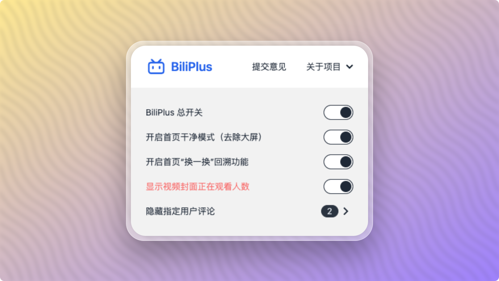

<a name="readme-top"></a>


<!-- PROJECT SHIELDS -->
[![Contributors][contributors-shield]][contributors-url]
[![Forks][forks-shield]][forks-url]
[![Stargazers][stars-shield]][stars-url]
[![Issues][issues-shield]][issues-url]
[![MIT License][license-shield]][license-url]


<!-- PROJECT LOGO -->
<br />
<div align="center">
  <a href="https://github.com/0xlau/biliplus">
    
  </a>

  <h3 align="center">BiliPlus 浏览器扩展</h3>

  <p align="center">
    一个可以在冲浪 bilibili.com 的时候体验更好的浏览器扩展
    <br />
    <br />
    <a href="https://chrome.google.com/webstore/detail/liddcdcjkpeaiblhebgihpmcaknpgbgk"><strong>前往谷歌扩展应用中心 »</strong></a>
    <br />
    <a href="https://microsoftedge.microsoft.com/addons/detail/ngkocakjkiflceafceddcmiolmdmmpcf"><strong>前往Edge扩展应用中心 »</strong></a>
    <br />
    <a href="https://addons.mozilla.org/zh-CN/firefox/addon/biliplus-bilibili-%E5%8A%A0%E5%A4%A7%E6%9D%AF-%E7%BB%86%E8%8A%82%E4%BB%8E%E5%A4%A7%E6%9D%AF%E5%81%9A%E8%B5%B7"><strong>前往火狐扩展应用中心 »</strong></a>
    <br />
    <br />
    <a href="https://chrome.google.com/webstore/detail/liddcdcjkpeaiblhebgihpmcaknpgbgk">Chrome 扩展</a>
    ·
    <a href="https://github.com/0xlau/biliplus/issues">报告 Bug</a>
    ·
    <a href="https://github.com/0xlau/biliplus/issues">提交建议</a>
  </p>
</div>


<!-- TABLE OF CONTENTS -->
<details>
  <summary>目录</summary>
  <ol>
    <li>
      <a href="#关于项目">关于项目</a>
    </li>
    <li>
      <a href="#快速开始">快速开始</a>
      <ul>
        <li><a href="#从扩展中心安装">从扩展中心安装</a></li>
        <li><a href="#手动安装">手动安装</a></li>
      </ul>
    </li>
    <li><a href="#路线图">路线图</a></li>
    <li><a href="#补丁">补丁</a></li>
    <li><a href="#贡献代码">贡献代码</a></li>
    <li><a href="#协议">协议</a></li>
    <li><a href="#联系">联系</a></li>
    <li><a href="#鸣谢">鸣谢</a></li>
  </ol>
</details>


<!-- ABOUT THE PROJECT -->
## 关于项目

<div align="center">
  
</div>

<br/>

[Bilibili.com](https://bilibili.com) 其实已经有一个完美的用户体验，但作为一个细节控的开发者，可能还有一些地方让我们感到不舒服，所以这个扩展诞生了。

设计原则:
* 影响原始外观。
* 保持哔哩哔哩的一贯风格。
* 如果你在哔哩哔哩网站冲浪体验不舒服，请前来提交建议。

<p align="right">(<a href="#readme-top">回到顶部</a>)</p>

<!-- GETTING STARTED -->
## 快速开始

这是一个示例，说明如何在本地设置此项目。
要获得本地副本并进行工作，请遵循以下简单的示例步骤。

### 从扩展中心安装

1. 打开 [Chrome 扩展中心](https://chrome.google.com/webstore/detail/liddcdcjkpeaiblhebgihpmcaknpgbgk).
2. 点击 `添加到 Chrome`.
你将在Chrome浏览器的工具栏上出现插件图标。

### 手动安装

_以下是如何从源代码手动安装的示例。_

1. 克隆仓库
   ```sh
   git clone https://github.com/0xlau/biliplus.git
   ```
2. 执行命令
   ```sh
   # Linux/MacOS
   > make

   # Windows
   > ./make.bat
   ```
3. 找到生成好的文件 `biliplus.zip`
   ```sh
   > ls
   biliplus.zip
   ```
4. 拖拽 `biliplus.zip` 到 Chrome/Edge 扩展列表页
    ```sh
    # Extension Page
    chrome://extensions
    edge://extensions
    ```
5. 关于如何安装扩展，更多详情可以见 [chromebook](https://support.google.com/chromebook/topic/3415446) to install extensions.

<p align="right">(<a href="#readme-top">回到顶部</a>)</p>

<!-- ROADMAP -->
## 路线图

- [x] 首页干净模式
- [x] 首页 “换一换” 回溯功能
- [x] 显示视频封面 AI 总结
- [x] 显示视频观看人数
- [x] 隐藏某个用户的所有评论
- [x] 隐藏搜索框中 bilibili 热搜
- [x] 无级调节视频速度
- [ ] ......

## 补丁

- [x] 解决无法使用 Esc 键退出图片预览问题

<p align="right">(<a href="#readme-top">回到顶部</a>)</p>

<!-- CONTRIBUTING -->
## 贡献代码

具体请访问 [Github仓库查看](https://github.com/0xlau/biliplus)

<p align="right">(<a href="#readme-top">回到顶部</a>)</p>


<!-- LICENSE -->
## 协议

MIT License。可以查看 `LICENSE.txt` 获取更多详情。

<p align="right">(<a href="#readme-top">回到顶部</a>)</p>


<!-- CONTACT -->
## 联系

码农小易 - [@thetimothylau](https://twitter.com/thetimothylau) - timothy-lau@outlook.com

项目链接: [https://github.com/0xlau/biliplus](https://github.com/0xlau/biliplus)

<p align="right">(<a href="#readme-top">回到顶部</a>)</p>


<!-- ACKNOWLEDGMENTS -->
## 鸣谢

* [Github-biliscope](https://github.com/gaogaotiantian/biliscope)
* [DaisyUI](https://daisyui.com/)
* [Tailwindcss](https://tailwindcss.com/)
* [Chrome Extension Docs](https://developer.chrome.com/docs/extensions)
* [Remixicon](https://remixicon.com/)
* [Img Shields](https://shields.io)

<p align="right">(<a href="#readme-top">回到顶部</a>)</p>


<!-- MARKDOWN LINKS & IMAGES -->
<!-- https://www.markdownguide.org/basic-syntax/#reference-style-links -->
[contributors-shield]: https://img.shields.io/github/contributors/0xlau/biliplus.svg?style=for-the-badge
[contributors-url]: https://github.com/0xlau/biliplus/graphs/contributors
[forks-shield]: https://img.shields.io/github/forks/0xlau/biliplus.svg?style=for-the-badge
[forks-url]: https://github.com/0xlau/biliplus/network/members
[stars-shield]: https://img.shields.io/github/stars/0xlau/biliplus.svg?style=for-the-badge
[stars-url]: https://github.com/0xlau/biliplus/stargazers
[issues-shield]: https://img.shields.io/github/issues/0xlau/biliplus.svg?style=for-the-badge
[issues-url]: https://github.com/0xlau/biliplus/issues
[license-shield]: https://img.shields.io/github/license/0xlau/biliplus.svg?style=for-the-badge
[license-url]: https://github.com/0xlau/biliplus/blob/master/LICENSE.txt
[chrome-shield]: https://img.shields.io/badge/-Plugin_Download-black.svg?style=for-the-badge&colorB=555
[chrome-url]: https://chrome.com/
